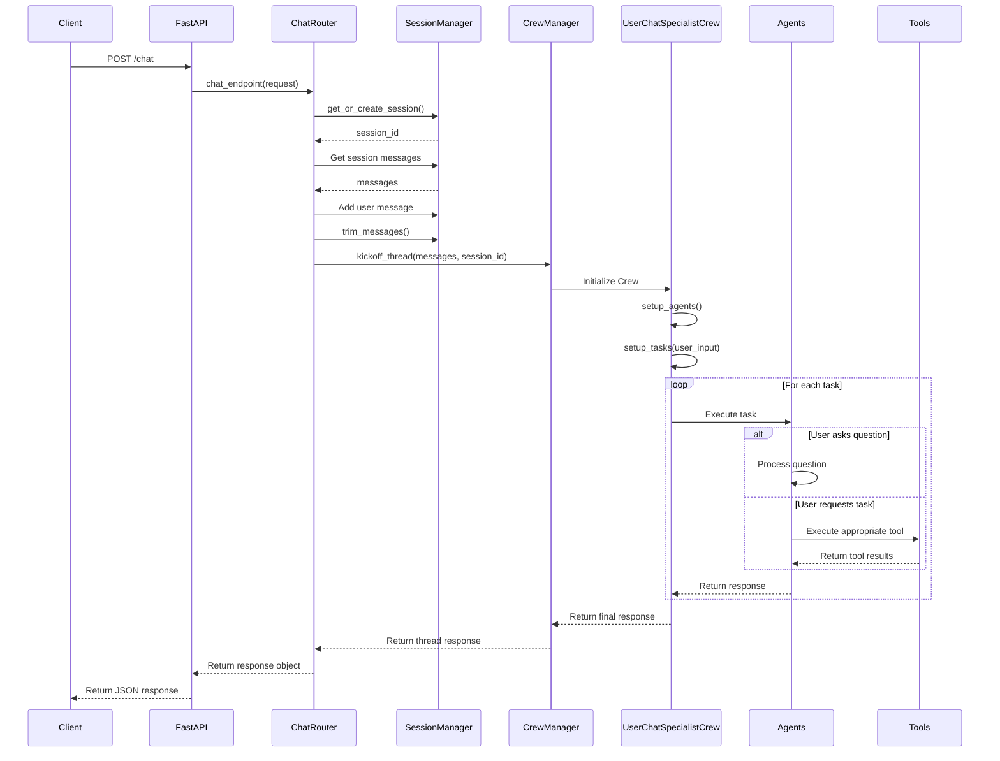

# Chat Endpoint Flow

This diagram illustrates the chat endpoint flow, highlighting:
1. Session management
2. Message handling
3. Crew initialization and execution
4. Task processing logic for questions vs tasks
5. Response flow back to client
